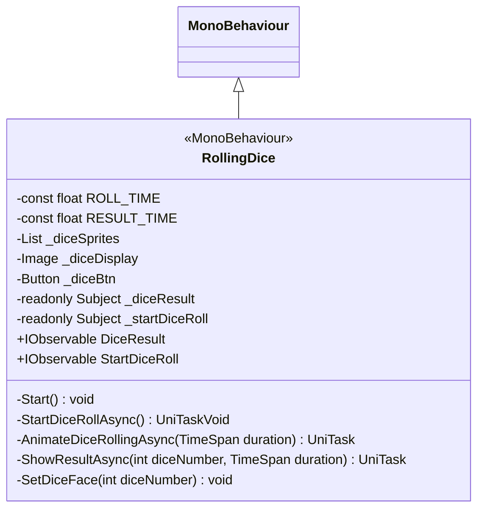

## 🤖 AI Generated C# Class Diagrams

### main/RollingDice.cs

Expand

```mermaid
classDiagram
    class RollingDice {
        <<MonoBehaviour>>
        -const float ROLL_TIME
        -const float RESULT_TIME
        -List<Sprite> _diceSprites
        -Image _diceDisplay
        -Button _diceBtn
        -readonly Subject<int> _diceResult
        -readonly Subject<Unit> _startDiceRoll
        +IObservable<int> DiceResult
        +IObservable<Unit> StartDiceRoll
        -Start() void
        -StartDiceRollAsync() UniTaskVoid
        -AnimateDiceRollingAsync(TimeSpan duration) UniTask<int>
        -ShowResultAsync(int diceNumber, TimeSpan duration) UniTask
        -SetDiceFace(int diceNumber) void
    }
    MonoBehaviour <|-- RollingDice
```

