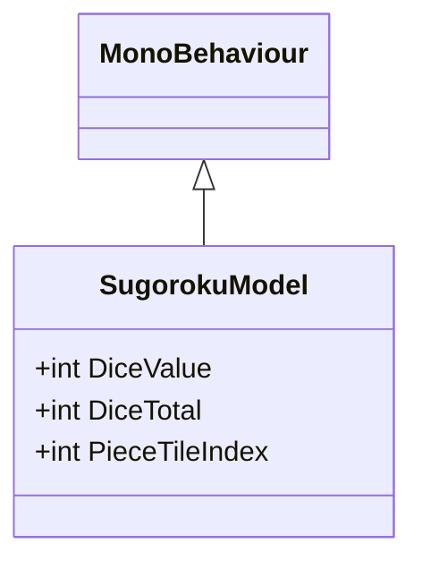
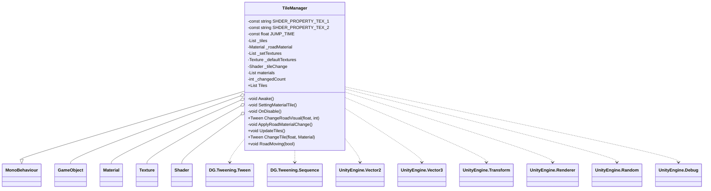
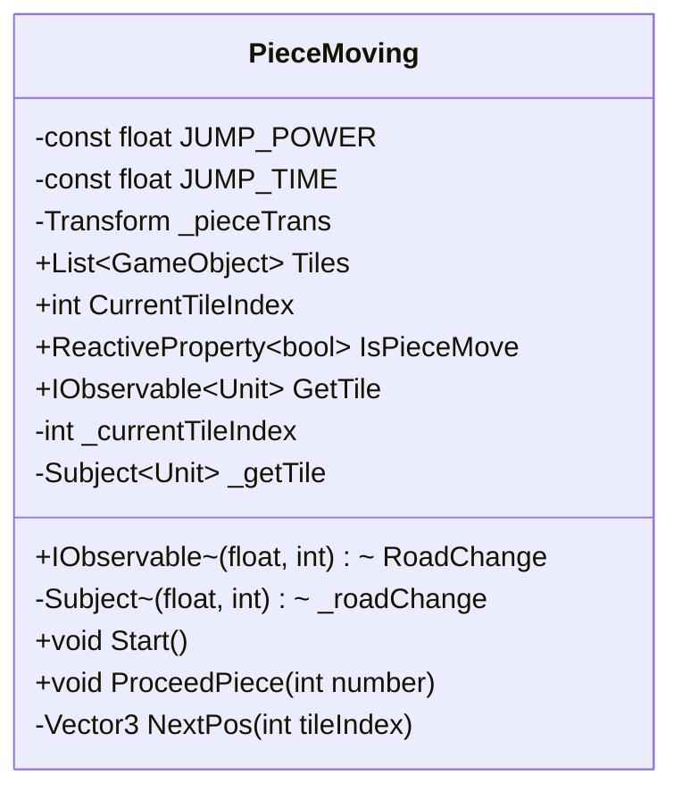
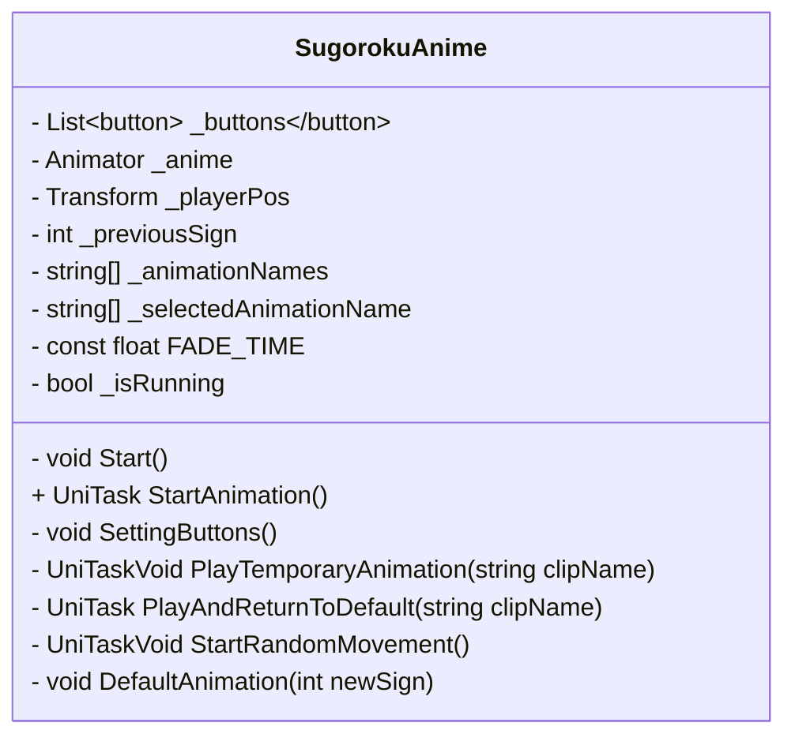
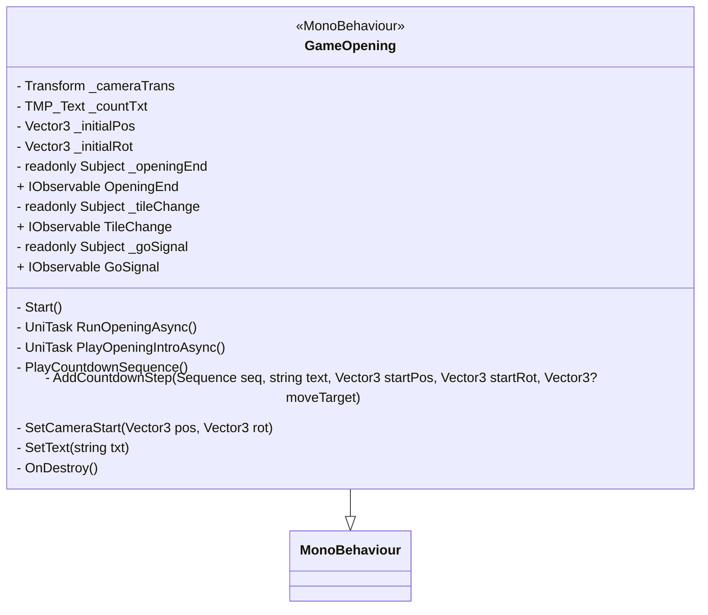
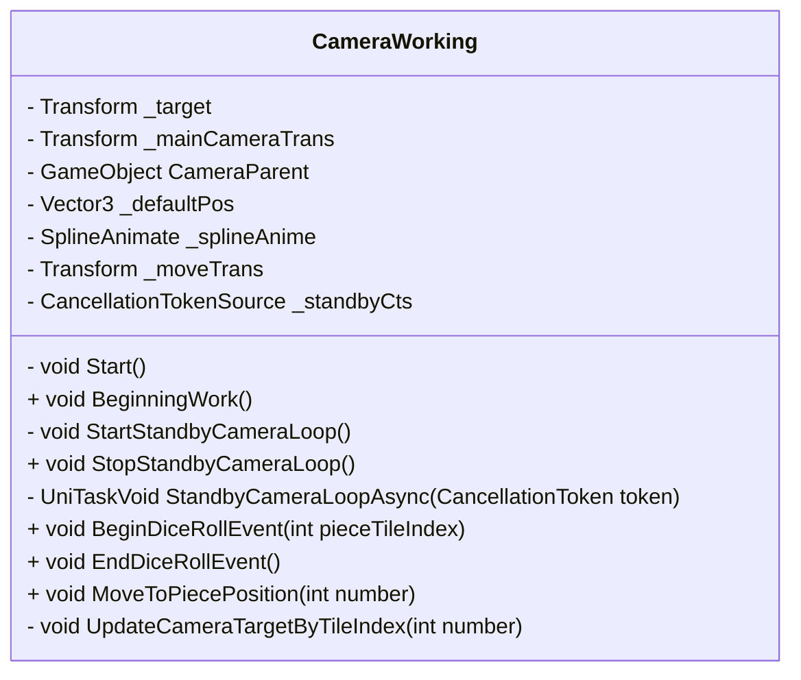
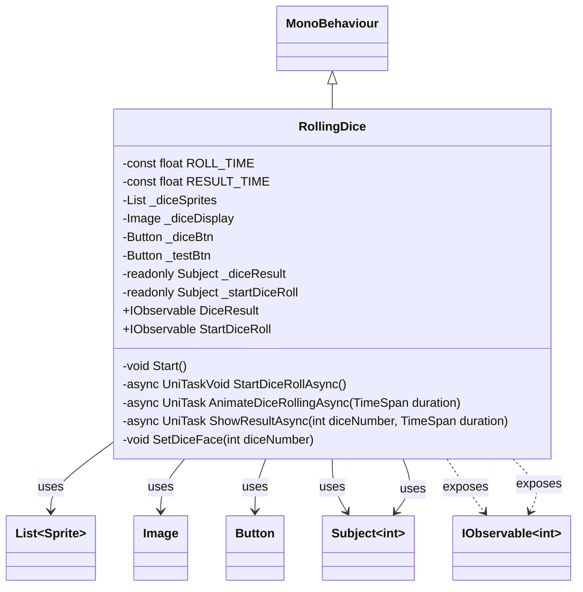
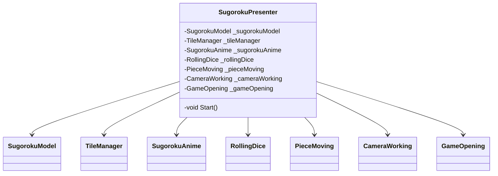

## 🤖 AI Generated C# Class Diagrams

### ./main/SugorokuModel.cs
<details><summary>Expand</summary>


```
</details>

### ./main/TileManager.cs
<details><summary>Expand</summary>


```
</details>

### ./main/PieceMoving.cs
<details><summary>Expand</summary>


```
</details>

### ./main/SugorokuAnime.cs
<details><summary>Expand</summary>


```
</details>

### ./main/GameOpening.cs
<details><summary>Expand</summary>


```
</details>

### ./main/CameraWorking.cs
<details><summary>Expand</summary>


```
</details>

### ./main/RollingDice.cs
<details><summary>Expand</summary>


```
</details>

### ./main/SugorokuPresenter.cs
<details><summary>Expand</summary>


```
</details>

